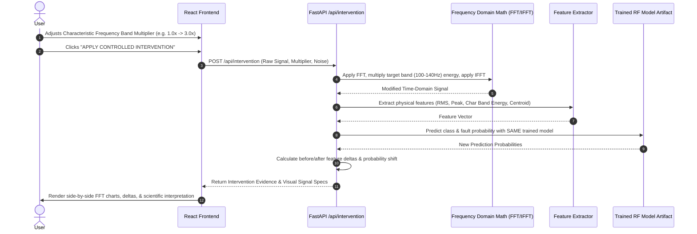

# Data Flow Pipeline: PhysioXAI

```mermaid
sequenceDiagram
    autonumber
    actor User
    participant UI as React Frontend
    participant API as FastAPI /api/intervention
    participant Math as Frequency Domain Math (FFT/IFFT)
    participant FE as Feature Extractor
    participant ML as Trained RF Model Artifact

    User->>UI: Adjusts Characteristic Frequency Band Multiplier (e.g. 1.0x -> 3.0x)
    User->>UI: Clicks "APPLY CONTROLLED INTERVENTION"
    UI->>API: POST /api/intervention (Raw Signal, Multiplier, Noise)
    API->>Math: Apply FFT, multiply target band (100-140Hz) energy, apply IFFT
    Math-->>API: Modified Time-Domain Signal
    API->>FE: Extract physical features (RMS, Peak, Char Band Energy, Centroid)
    FE-->>API: Feature Vector
    API->>ML: Predict class & fault probability with SAME trained model
    ML-->>API: New Prediction Probabilities
    API->>API: Calculate before/after feature deltas & probability shift
    API-->>UI: Return Intervention Evidence & Visual Signal Specs
    UI->>User: Render side-by-side FFT charts, deltas, & scientific interpretation
```
