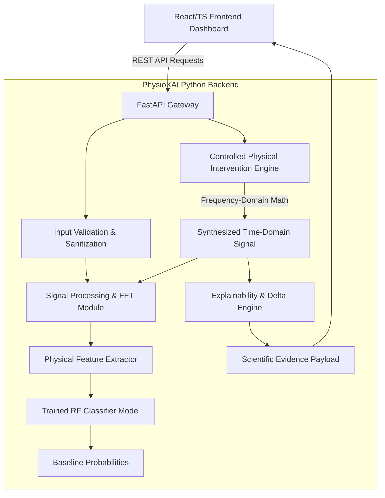

# System Architecture: PhysioXAI

PhysioXAI is designed with a decoupled React/TypeScript frontend workstation and a FastAPI backend service powering signal processing, ML inference, and physical intervention.

## Security Boundaries
1. **Pydantic Validation Layer**: All numeric signals, sampling rates, and frequency boundaries are bounded and sanitized before hitting SciPy/NumPy computations.
2. **Model Integrity**: The Random Forest model artifact is strictly loaded from repository storage. Model uploading is forbidden to prevent arbitrary pickle code execution.
3. **CORS & Headers**: Strict CORS origin checking via `FRONTEND_URL` and security headers (`X-Content-Type-Options`, `Content-Security-Policy`).
